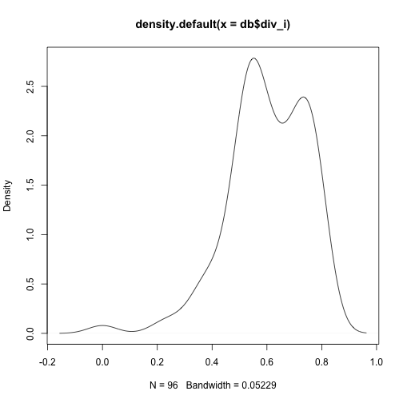
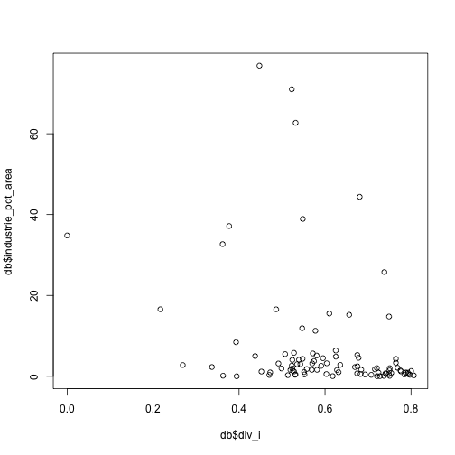

# A Knitr example 

## Abstract

Cities have become playing grounds for competitive behaviour and rapid economic dynamics. But in many cities (or urban agglomerations) economic growth is mainly manifested in specific geographic areas, where creative people and innovative entrepreneurs are located. This paper offers first the foundation for analysing the so-called 'urban buzz' and its interlinked primary drivers. The paper will next develop an analytical framework for testing the buzz hypothesis, with a special reference to the importance of social networks in Amsterdam. In our empirical analysis, we use a unique data set on social network connectivity and spatial concentration in a city, based on location-sharing services through the use of Foursquare. Our urban buzz model shows clearly that buzz and socio-economic (cultural) diversity are closely connected phenomena.

## Read in the data

```r
library(knitr)
db <- read.csv("~/Thomas/Colleges/WooW/examples/buzz_data.csv")
```


## print top


```r
head(db)
```

## print tail


```r
tail(db)
```

## print summary

```r
summary(db)
```

```
##           id     X4sq.pct_Arts...Entertainment
##  BU03630000: 1   Min.   : 0.00                
##  BU03630001: 1   1st Qu.: 0.00                
##  BU03630002: 1   Median : 0.00                
##  BU03630003: 1   Mean   : 7.99                
##  BU03630004: 1   3rd Qu.:15.89                
##  BU03630005: 1   Max.   :46.15                
##  (Other)   :90                                
##  X4sq.pct_College...University X4sq.pct_Food    X4sq.pct_Other 
##  Min.   : 0.0                  Min.   :  0.00   Min.   :  0.0  
##  1st Qu.: 0.0                  1st Qu.:  0.00   1st Qu.: 25.0  
##  Median : 0.0                  Median :  0.00   Median : 50.0  
##  Mean   : 1.5                  Mean   :  6.50   Mean   : 46.1  
##  3rd Qu.: 0.0                  3rd Qu.:  5.79   3rd Qu.: 63.7  
##  Max.   :50.0                  Max.   :100.00   Max.   :100.0  
##                                                                
##  X4sq.pct_Outdoors...Recreation X4sq.pct_Professional...Other.Places
##  Min.   :  0.00                 Min.   :  0.0                       
##  1st Qu.:  0.00                 1st Qu.:  0.0                       
##  Median :  0.00                 Median :  0.0                       
##  Mean   :  1.62                 Mean   : 12.2                       
##  3rd Qu.:  0.00                 3rd Qu.: 16.7                       
##  Max.   :100.00                 Max.   :100.0                       
##                                                                     
##  X4sq.pct_Travel...Transport industrie_pct_area kantoor_pct_area
##  Min.   :  0.00              Min.   : 0.00      Min.   : 0.01   
##  1st Qu.:  0.00              1st Qu.: 0.79      1st Qu.: 1.40   
##  Median :  0.00              Median : 1.97      Median : 3.65   
##  Mean   :  7.04              Mean   : 7.19      Mean   : 8.52   
##  3rd Qu.: 11.11              3rd Qu.: 4.89      3rd Qu.:10.34   
##  Max.   :100.00              Max.   :76.82      Max.   :84.00   
##                                                                 
##  sport_pct_area   winkel_pct_area X4sq_total_venues  total_units   
##  Min.   : 0.000   Min.   : 0.00   Min.   :  0.0     Min.   :   13  
##  1st Qu.: 0.090   1st Qu.: 1.31   1st Qu.:  1.0     1st Qu.: 2390  
##  Median : 0.363   Median : 2.38   Median :  6.0     Median : 4844  
##  Mean   : 1.351   Mean   : 3.41   Mean   : 12.9     Mean   : 4822  
##  3rd Qu.: 1.204   3rd Qu.: 4.42   3rd Qu.: 11.0     3rd Qu.: 6723  
##  Max.   :29.413   Max.   :29.07   Max.   :116.0     Max.   :14763  
##                                                                    
##      div_i        checkins_all  X..WeekDay....Afternoon..
##  Min.   :0.000   Min.   :   5   Min.   :   0.0           
##  1st Qu.:0.525   1st Qu.: 147   1st Qu.:  33.0           
##  Median :0.599   Median : 422   Median :  80.5           
##  Mean   :0.601   Mean   : 807   Mean   : 204.9           
##  3rd Qu.:0.725   3rd Qu.:1028   3rd Qu.: 262.0           
##  Max.   :0.807   Max.   :6620   Max.   :1834.0           
##                                                          
##  X..WeekDay....Evening.. X..WeekDay....Morning.. X..WeekDay....Night..
##  Min.   :   0            Min.   :   1.0          Min.   :  0.0        
##  1st Qu.:  20            1st Qu.:  33.8          1st Qu.:  9.0        
##  Median :  78            Median :  87.0          Median : 30.0        
##  Mean   : 155            Mean   : 184.6          Mean   : 59.4        
##  3rd Qu.: 178            3rd Qu.: 274.0          3rd Qu.: 82.8        
##  Max.   :1236            Max.   :1407.0          Max.   :419.0        
##                                                                       
##  X..WeekEnd....Afternoon.. X..WeekEnd....Evening.. X..WeekEnd....Morning..
##  Min.   :  0.0             Min.   :  0.0           Min.   :  0.0          
##  1st Qu.: 20.0             1st Qu.:  8.8           1st Qu.:  8.8          
##  Median : 42.0             Median : 23.5           Median : 19.5          
##  Mean   : 84.0             Mean   : 49.1           Mean   : 37.9          
##  3rd Qu.: 90.8             3rd Qu.: 55.0           3rd Qu.: 53.2          
##  Max.   :816.0             Max.   :333.0           Max.   :324.0          
##                                                                           
##  X..WeekEnd....Night..
##  Min.   :  0.0        
##  1st Qu.:  4.0        
##  Median : 14.5        
##  Mean   : 31.2        
##  3rd Qu.: 38.0        
##  Max.   :263.0        
## 
```

## kernel density 

```r
plot(density(db$div_i))
```

 

## Scatter


```r
plot(db$div_i, db$industrie_pct_area)
```

 

## OLS Model

For the following model: $$\text{Checkins} = \alpha \text{total_units} + \beta \text{div}_i +\epsilon$$

```r
ols <- lm("checkins_all ~ total_units + div_i", data = db)
```

## Plain text summary

```r
summary(ols)
```

```
## 
## Call:
## lm(formula = "checkins_all ~ total_units + div_i", data = db)
## 
## Residuals:
##    Min     1Q Median     3Q    Max 
##  -1315   -533   -290     87   5845 
## 
## Coefficients:
##              Estimate Std. Error t value Pr(>|t|)   
## (Intercept)  9.19e+02   4.55e+02    2.02   0.0462 * 
## total_units  1.14e-01   3.93e-02    2.90   0.0046 **
## div_i       -1.10e+03   8.15e+02   -1.35   0.1799   
## ---
## Signif. codes:  0 '***' 0.001 '**' 0.01 '*' 0.05 '.' 0.1 ' ' 1
## 
## Residual standard error: 1040 on 93 degrees of freedom
## Multiple R-squared:  0.0832,	Adjusted R-squared:  0.0635 
## F-statistic: 4.22 on 2 and 93 DF,  p-value: 0.0176
```

## HTML summary

```r
library(xtable)
print(xtable(ols), type = "html")
```

<!-- html table generated in R 3.0.2 by xtable 1.7-1 package -->
<!-- Thu Jan 16 09:14:03 2014 -->
<TABLE border=1>
<TR> <TH>  </TH> <TH> Estimate </TH> <TH> Std. Error </TH> <TH> t value </TH> <TH> Pr(&gt |t|) </TH>  </TR>
  <TR> <TD align="right"> (Intercept) </TD> <TD align="right"> 918.6409 </TD> <TD align="right"> 454.5845 </TD> <TD align="right"> 2.02 </TD> <TD align="right"> 0.0462 </TD> </TR>
  <TR> <TD align="right"> total_units </TD> <TD align="right"> 0.1141 </TD> <TD align="right"> 0.0393 </TD> <TD align="right"> 2.90 </TD> <TD align="right"> 0.0046 </TD> </TR>
  <TR> <TD align="right"> div_i </TD> <TD align="right"> -1100.9067 </TD> <TD align="right"> 814.7372 </TD> <TD align="right"> -1.35 </TD> <TD align="right"> 0.1799 </TD> </TR>
   </TABLE>

